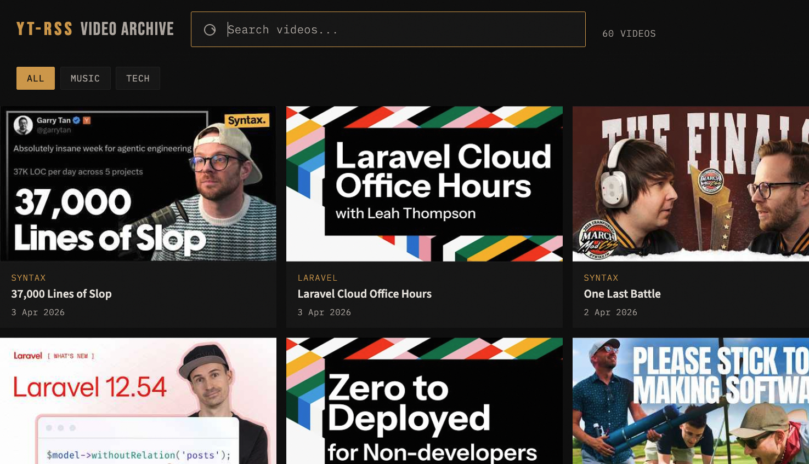

# yt-rss

Keep track of YouTube channels without suffering YouTube's subscription page.



## Why

YouTube's subscription page is a single unsorted list. If you follow a mix of tech channels, music labels, whatever it gets very noisy..

So this little app pulls YouTube channels via their public RSS feeds and gives you a CLI and a web UI to browse recent uploads. You organise channels into categories and filter by them.

It's all stored in a local SQLite database. Compiles to a single binary, no external dependencies.

## Prerequisites

- Go 1.25 or later

## Getting started

Clone the repo and build:

```bash
git clone git@github.com:ohnotnow/yt-rss.git
cd yt-rss
go build -o yt-rss ./cmd/
```

Or just grab a binary from the [releases page](https://github.com/ohnotnow/yt-rss/releases) - there are builds for macOS, Linux, and Windows.

## Usage

### Categories

Create a few categories first:

```bash
yt-rss category add music
yt-rss category add tech
yt-rss category list
```

### Adding channels

Pass any YouTube channel URL - handles, `/channel/` URLs, legacy `/user/` URLs, whatever.

```bash
yt-rss add https://www.youtube.com/@somechannel
yt-rss add https://www.youtube.com/@somechannel --category music
yt-rss list
```

Wrong category? Just edit it:

```bash
yt-rss edit 1 --category tech
```

### Fetching and browsing

Pull the latest uploads:

```bash
yt-rss fetch       # all channels
yt-rss fetch 3     # just channel 3
```

Then browse them in the terminal:

```bash
yt-rss videos        # latest 20 across all channels
yt-rss videos 3 50   # latest 50 from channel 3
```

### Web UI

```bash
yt-rss serve          # default port 8080
yt-rss serve 3000     # custom port
```

Search bar, category filters, grid of video cards that link straight to YouTube. The HTML is embedded in the binary so there's nothing else to deploy.

There's a settings panel behind the cog icon (top-right) where you can manage everything without touching the CLI:

- **Channels** — add new channels by URL, assign them to categories, remove ones you're bored of
- **Categories** — create and delete categories
- **Fetch** — pull the latest uploads for all channels or just a specific one from a dropdown

### Other commands

```bash
yt-rss list           # show all tracked channels
yt-rss remove 5       # stop tracking a channel
yt-rss help           # full command reference
```

## Running tests

```bash
go test ./...
```

## Contributing

Fork it, hack on it, run `go build ./cmd/` and `go test ./...`, open a PR.

## Licence

[MIT](LICENSE)
